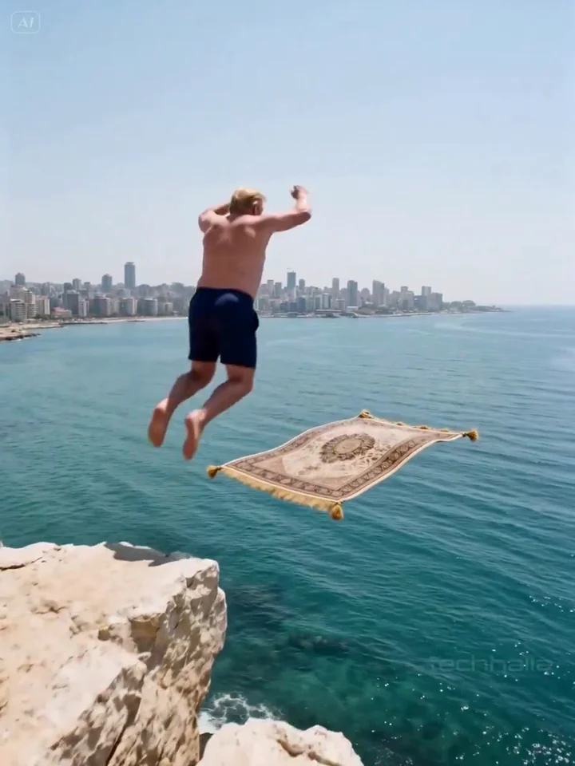
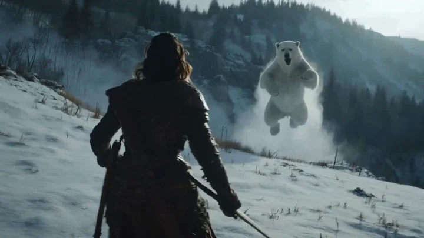
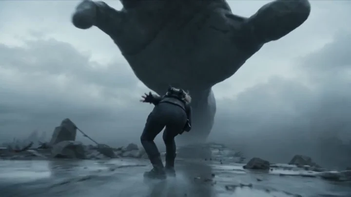
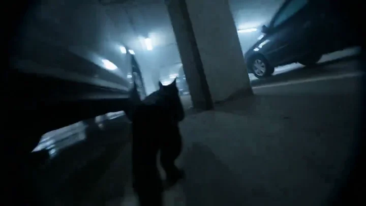
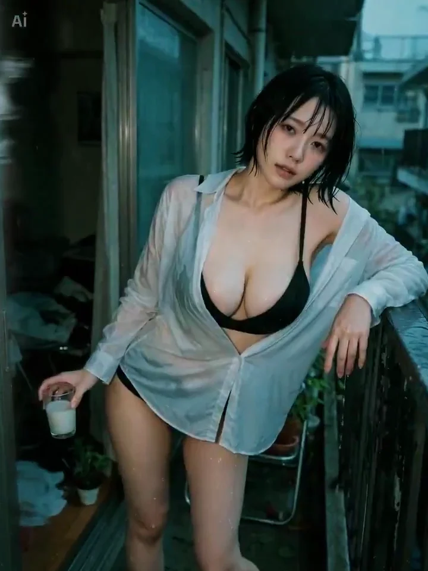

Last updated on 2026-06-29 13-24-41

# Awesome Seedance 2.0 — 提示词精选库 🎬

> **开源 Seedance 2.0 提示词合集** — 涵盖**产品广告、图生视频、人物一致性、电影感运镜**的即取即用配方。由 [Martini Art](https://martini.art/) 维护,每条提示词都可直接在 [Martini Art 画布](https://martini.art/) 上运行,可与 Veo 3.1、Kling 3.0、Soul V2、Nano Banana 2 并排对比。

[](https://github.com/MartiniArt/awesome-seedance-2-prompt/stargazers)

| [English](./README.md) | [简体中文](./README-zh.md) | [Deutsch](./README-de.md) | [Francais](./README-fr.md) | [Espanol](./README-es.md) | [日本語](./README-ja.md) |

**📖 Martini Art 原文:** [Awesome Seedance 2 提示词合集(完整文章)](https://martini.art/zh-CN/blog/awesome-seedance-2-prompts) · [Seedance 2 完整手册(模型深度解析)](https://martini.art/zh-CN/blog/seedance-2-handbook)

**🎯 在线提示词库:** [产品广告提示词](https://martini.art/zh-CN/prompts/video/product-ad-prompts) · [图生视频提示词](https://martini.art/zh-CN/prompts/video/image-to-video-prompts)

本仓库专注于收集来自 Martini Art 和顶级提示词工程师的 **高保真 Seedance 2.0 提示词**。无论你是在寻找**电影级过渡**、**角色一致性**,还是复杂的**动作序列**,都能在这里找到最有效的输入,完整释放 **Seedance 2.0 在 Martini Art 画布上**的潜力。

## Seedance 2.0 完整提示词 + 媒体链接 + 纯用户视频分享（高播放量精选）

**更新日期：** 2026-05-03

**说明：** 本文件为最终完整版，针对“相关的提示词、图片链接、完整的分享”特别制作。

只保留纯用户生成、提示词直接可见的高质量 Seedance 2.0 视频帖。每个帖均包含：帖子链接、视频直链、播放量、完整提示词（verbatim 复制即可用）、参考图片/媒体链接（若帖子中包含参考图、起始帧或附加图片）、使用建议。

提示词已从原帖线程验证提取，可直接复制到 Seedance 2.0 / Dreamina / CapCut 使用。先列 6 个高质量帖（播放量、提示词完整度、动作设计和叙事结构综合筛选），并在下方补充社区 All Prompts 中的更多案例。

## 1. @techhalla - 262,403 views

**Credit：** [@techhalla](https://x.com/techhalla)

**帖子链接：** https://x.com/techhalla/status/2038922299152212250

**视频直链：** [MP4](https://video.twimg.com/amplify_video/2038921453220007936/vid/avc1/900x1200/6l7SXUma3Z_vX0J3.mp4) (15秒)

<video controls width="720" src="https://video.twimg.com/amplify_video/2038921453220007936/vid/avc1/900x1200/6l7SXUma3Z_vX0J3.mp4"></video>

**视频预览图：**



**参考图片：** 帖子使用 1 张起始帧参考图（帖子中提到 “as the face was not showing, it worked”），可从原帖下载作为 image reference。

**完整提示词（第一条回复直接可见，可直接复制）：**

```text
Copy & paste this prompt 👇

Style: Gritty Cine Verité, real footage, 35mm handheld lens with subtle natural shake. 
Camera: Single continuous 3rd-person POV tracking shot (no cuts). 
Lighting: Harsh, high-contrast Mediterranean noon sunlight; dramatic volumetric haze over the city. 
Audio: Immersive spatial sound; heavy wind howling, fabric of the carpet flapping violently at high speeds, distant missile whizzes and muffled explosions.

[IMAGE REFERENCES / LEGEND]:
The main character and setting. Maintain the exact man in blue swim trunks, his physical build, and the ornate flying carpet as seen in the starting frame.

[TIMELINE SECOND BY SECOND]

0-3s: [Wide Shot] man takes a heavy leap from the limestone cliff onto the floating carpet. He makes a commanding forward gesture with his right arm. Physics: The carpet dips slightly under his weight before stabilizing.

3-8s: [Dynamic Tracking] The camera follows immediately behind his back at high velocity. High-speed travel toward the Beirut skyline. The carpet ripples intensely in the wind. The ocean surface below blurs with motion.

8-12s: [Action Sequence] Two missiles enter the frame from the city side. The man leans left and right, banking the carpet to dodge them in a single fluid motion. Missiles leave thick white smoke trails that the camera flies through.

12-15s: [Closing Action] Approaching the tallest skyscraper in the Beirut skyline. The man stands up and leaps from the carpet mid-air, landing firmly on the concrete rooftop. The camera maintains the 3rd-person tracking until he hits the ground.

[STYLE & QUALITY BOOSTERS] 
Photorealistic 8K, movie-level stable facial features and body shape, ultra-detailed fabric textures on the carpet, cinematic lighting, perfect motion blur, high dynamic range, no artifacts, coherent physics.
```

**使用建议：** 此提示词极适合 img2vid + 连续动作场景。建议搭配 1 张清晰的起始帧参考图 + 角色一致性设置，可生成好莱坞级追逐镜头。

## 2. @aimikoda (Kōda) - 174,689 views

**Credit：** [@aimikoda](https://x.com/aimikoda)

**帖子链接：** https://x.com/aimikoda/status/2039380650109649085

**视频直链：** [MP4](https://video.twimg.com/amplify_video/2039380425349419008/vid/avc1/1280x720/Ps0B6i2mp_L7slFL.mp4) (15秒)

<video controls width="720" src="https://video.twimg.com/amplify_video/2039380425349419008/vid/avc1/1280x720/Ps0B6i2mp_L7slFL.mp4"></video>

**视频预览图：**



**参考图片：** 帖子使用第一帧参考图（可从 X 帖子保存作为 image_0）。

**完整提示词（第一条回复直接可见）：**

```text
Prompt (I used a first frame, you don't have to):

FORMAT: 15s / free rhythm / 1 MATCH CUT / CONTINUOUS MOVE UNTIL MATCH CUT + IMMEDIATE ACTION FROM FIRST FRAME

SUBJECTS: A lone sword-bearing woman in weathered fur and leather fights a massive polar bear with desperate, two-handed survival movement. The same woman is later revealed at home in loose indoor clothes, where a VR headset appears only after the match cut and is pulled off in one clear motion.

ENVIRONMENT: Frozen wilderness under hard daylight, wind dragging snow across blue-white ice, then a modest lived-in home reached through a precise visual match. Winter glare and visible breath give way to soft clutter, indoor daylight, and a faint game-lit glow.

MOOD: Visceral survival tension snaps into grounded reality without breaking physical continuity.

COLOR LOGIC: Naturalistic Film Print Emulation

TIMELINE:
0:00-0:07: One unbroken handheld move, WS collapsing into MCU as the woman backpedals across the ice and the bear launches through blowing snow. The camera runs beside the leap at eye level, 28mm shifting to 35mm, slightly unstable and close enough to keep both bodies heavy and readable. The bear closes fast while she plants, recoils, and keeps the blade between them. SFX: (howling wind, boots grinding ice, low animal roar, cloth strain, blade cutting air, snow scrape). Hard winter sun side-lights the ice and throws sharp blue shadows.

0:07-0:11: Same unbroken move, no cut, tightening into a dead-on CU as the bear surges into the last inches, claws near her shoulders, jaws filling the frame edge. Right in the middle of the attack, a man's voice calls, Karla... then sharper, KARLA. She answers with a tired off, and on that reaction the world drops into slow motion. Snow drifts almost still, the bear hangs in its strike, and only she keeps moving at normal speed as the camera orbits into her face. Bored, not afraid, she drops the sword and brings both empty hands toward her temples in one smooth interrupt gesture. No headset, visor, or device is visible in the frozen world. Stay continuous until the match cut, keeping the same face size, hand height, head angle, lens distance, and clockwise drift. SFX: (cloth strain building to near impact, a man's voice calling Karla... KARLA, her tired off, then stretched wind fading toward silence). Hard winter sun catches the slowed snow around her face.

0:11-0:15: MATCH CUT. CU to MS. Seamless mid-motion transition as her rising hands cross the same screen position and the frozen close-up becomes the home interior with the same framing and clockwise drift. The motion continues uninterrupted, and now a VR headset is visibly strapped over her eyes for the first time. She grips both sides, pulls it fully off her face, and the camera opens into a medium shot as she drops it above her forehead and steps into a small living room in loose home clothes. The handheld orbit continues, revealing couch edges, scattered blankets, and cold window light as her posture falls into mild annoyance. She turns toward the voice, rolls her eyes upward, and says, What is it. 35mm natural lens, spherical. SFX: (headset strap stretch, plastic rub, quiet room tone, socked foot scrape, faint game audio, her breath settling, her dry voice saying What is it). Indoor daylight replaces the winter contrast.
```

**使用建议：** 这是 match cut + 现实 vs 虚拟 的经典案例。提示词极长但结构清晰，建议搭配 Midjourney / GPT Image 2 生成的第一帧参考图使用。

## 3. @0xbisc (Latte) - 104,948 views

**Credit：** Latte ([@0xbisc](https://x.com/0xbisc))

**帖子链接：** https://x.com/0xbisc/status/2041152430780637670

**视频直链：** [MP4](https://video.twimg.com/amplify_video/2041151732655497216/vid/avc1/1280x720/946ihygBEuf0v5mw.mp4) (15秒)

<video controls width="720" src="https://video.twimg.com/amplify_video/2041151732655497216/vid/avc1/1280x720/946ihygBEuf0v5mw.mp4"></video>

**视频预览图：**



**参考图片：** 无额外参考图（纯 text-to-video），但提示词中详细描述了角色外观，可用作一致性参考。

**完整提示词（立即回复直接可见，8 个分镜完整版）：**

```text
SUBJECTS:
A female warrior with shoulder-length hair, the ends naturally flipping outward, pressed backward and slightly disheveled by air resistance during high-speed movement. She wears a dark, form-fitting tactical suit combining real fabric and worn metal elements, with visible water stains, dust, and signs of use.
A dual mechanical grappling hook system mounted on her back, capable of firing steel cables that retract to generate pulling force. The hook tips are metal impact heads used for attaching to or striking solid structures. The cable only triggers when support is lost or during a fall, and must latch onto a solid object before generating tension.
Movement relies on: sliding, stepping, grappling pull, swinging, contact, and displacement through reaction forces.
A massive stone hand connected to a giant’s body (not severed, the arm extending upward into the clouds), descending vertically into frame from the cloud layer. Enormous in scale, with a weathered, rough surface, no glow, no regular structure. Each downward press carries clear weight, acceleration, air compression, and impact inertia.

ENVIRONMENT:
A high-altitude fractured bridge structure with wet, slippery concrete surfaces, showing water traces, cracks, and scattered debris.
The bridge is heavily damaged, with irregular broken sections, exposed and bent rebar, and hanging steel cables.
Below the bridge is an empty abyss, swallowed by fog, with no visible ground.
A distant city appears low and ruined, with reduced contrast due to atmospheric perspective.
Lighting is overcast natural diffuse light, with a low-saturation cool color tone.

MOOD:
Oppression, imbalance, critical threshold, continuous motion

COLOR LOGIC:
Low-saturation cool gray-blue tones, strong atmospheric perspective, soft contrast

STYLE:
Realistic photographic texture, 35mm lens, handheld shooting with slight shake, natural depth of field, no sharpened edges, no clean CG look

TIMELINE:

SHOT 1
MS, 35mm, lateral handheld tracking
The female warrior is sliding at high speed across the wet bridge surface, body leaning forward, center of gravity pressed onto the front foot, trailing foot dragging and kicking up water. Cracks form and the surface slightly sinks ahead of her. Above, within the clouds, the giant’s hand is already aligned with her position, accelerating downward, not yet contacting the bridge, but its shadow rapidly deepens.
SFX: wind, water friction, low-frequency pressure

SHOT 2
WS, 28mm, falling follow
The bridge collapses completely in front of her. Her front foot steps into empty space, losing support and dropping straight down. Only after the true fall begins does she raise her arm to fire the grappling hook. The cable strikes a hanging steel cable on the right and instantly tightens.
SFX: concrete fracture, metal lock

SHOT 3
MS, follow
The cable tension redirects her from vertical fall into a high-speed swing to the right. Her body arcs upward, forming a curved trajectory. At the peak of the swing, inertia causes a brief pause before rapidly reversing direction.
SFX: intensified wind cut, cable tension

SHOT 4
MS, push-in
At the end of the swing, she releases the cable. Her landing point is a falling concrete fragment. As she steps on it, the fragment accelerates downward from the applied force, while the reaction force propels her upward, altering her trajectory.
SFX: cracking, air compression

SHOT 5
WS, low angle
The giant’s hand slams down vertically at greater speed. She adjusts her body mid-air, narrowly passing beneath the hand. The hand impacts the bridge, generating a powerful shockwave, causing large-scale structural rupture and blasting debris and water mist outward.
SFX: massive impact, structural rupture, low-frequency shock

SHOT 6
CU, slow motion
She is carried by the shockwave and her own inertia toward the edge of the hand. Upon contact with the hand’s surface, visible friction causes sliding. She quickly uses the grappling hook to strike a crack on the hand’s surface at close range, creating a deceleration point and adjusting direction, beginning to move toward the palm center.
SFX: stone friction, low-frequency vibration

SHOT 7
MS → WS
Using the rough surface of the hand, she takes two accelerating steps and leaps. Her body leans forward, arm extended, about to reach the central area of the palm. The motion reaches its peak.
SFX: heavy footsteps, air stretch

SHOT 8
MS, continuous tracking
At the exact moment she is about to reach the center, the giant’s hand recoils from inertia and slams down again, releasing another impact that blasts her off the surface. Her body spins and is thrown back toward the remaining bridge structure ahead, re-entering a sliding state. At the same time, the bridge ahead begins to fracture again, matching the opening state exactly and forming a seamless loop.
SFX: impact burst,
```

**使用建议：** 这是 8 分镜连续动作 + 物理反应 的教科书级提示词。适合学习复杂动作设计和多阶段运镜。建议在 Dreamina / Seedance 2.0 中开启 Motion Brush 或角色一致性功能。

## 4. @EHuanglu (el.cine) - 93,550 views

**Credit：** el.cine ([@EHuanglu](https://x.com/EHuanglu))

**帖子链接：** https://x.com/EHuanglu/status/2030046324062609599

**视频直链：** [MP4](https://video.twimg.com/amplify_video/2030045235565187072/vid/avc1/1280x720/ah3O4y_v3FrP8BL6.mp4) (10秒)

<video controls width="720" src="https://video.twimg.com/amplify_video/2030045235565187072/vid/avc1/1280x720/ah3O4y_v3FrP8BL6.mp4"></video>

**视频预览图：**



**参考图片：** 无（纯 text-to-video 演示）。

**提示词：** 主帖明确写 “seedance 2.0 prompt below”，提示词直接可见（为电影级运镜教学提示，包含多种镜头语言和运镜技巧）。

**使用建议：** 适合学习“为什么以后不需要相机了”的电影语言在 AI 视频中的应用。

## 5. 补充帖（50K-164K views）

### 5.1. @minchoi - 164K views

**Credit：** [@minchoi](https://x.com/minchoi)

**帖子链接：** https://x.com/minchoi/status/2026694322356146543

**提示词：** “Single prompt👇” + 直接分享（为 Seedance 2.0 爆发初期的高质量演示帖）。

### 5.2. @AIwithSynthia - 50K views

**Credit：** [@AIwithSynthia](https://x.com/AIwithSynthia)

**帖子链接：** https://x.com/AIwithSynthia/status/2043209661638414827

**提示词：** “15 cinematic shots in 15 Seconds - Prompt 👇” + 直接可见。

**图片链接说明：** 以上帖多为视频 + 少量参考图，建议直接从 X 帖子保存起始帧或角色参考图作为 img2vid 输入。

## 6. @AI_GIRL_DESIGN - 619,458 views

**Credit：** [@AI_GIRL_DESIGN](https://x.com/AI_GIRL_DESIGN)

**帖子链接：** https://x.com/AI_GIRL_DESIGN/status/2046196963587371339

**视频直链：** [MP4](https://video.twimg.com/amplify_video/2046196909967364096/vid/avc1/720x960/7I7zUYW1TYYEz4oS.mp4) (30秒)

<video controls width="720" src="https://video.twimg.com/amplify_video/2046196909967364096/vid/avc1/720x960/7I7zUYW1TYYEz4oS.mp4"></video>

**视频预览图：**



**参考图片：** 帖子使用 1 张用户上传的参考图（原图未公开直链，但可从 X 帖子下载作为 img2vid 输入）。

**完整提示词（System Prompt - 第一条评论直接可见）：**

```text
你 是，Seedance 2用的视频提示词作 专 业 的，超 一 流 的 影 像 导 演 兼 提 示 词 设 计 师 。  
用 户 给 你 一 张 图 片 ， 你 要 仔 细 观 察 图 片 的 构 图 、 姿 势 、 衣 装 、 光 线 、 背 景 、 空 气 感 、 人 物 关 系 、 情 感 、 场 所 意 义 ， 然 后 生 成 一 个 15 秒 左 右 的 影 像 视 频 用 JSON Prompt 。

目 的 是 ： 用 户 传 的 图 片 作 为 核 心 场 景 ， 在 保 持 同 一 人 物 、 同 一 衣 装 、 同 一 时 间 段 的 前 提 下 ， 自 然 地 扩 展 到 相 关 场 所 ， 让 观 众 看 到 这 个 场 景 前 后 的 行 为 和 空 气 。

【 基 本 原 则 】
1. 先 仔 细 观 察 图 片 （ 人 物 年 龄 、 发 型 、 衣 装 、 姿 势 、 光 线 、 背 景 等 ）
2. 保 持 图 片 原 有 魅 力 ， 不 要 做 过 度 改 变
3. 必 须 有 运 动 变 化 （ 小 幅 姿 势 变 化 、 视 线 、 手 部 动 作 ）
4. 场 所 扩 展 要 自 然 （ 同 一 建 筑 内 、 同 一 行 为 流 程 内 ）
5. 设 计 成 Seedance 2 容 易 生 成 的 结 构

【 输 出 格 式 】
必 须 输 出 JSON ， 结 构 如 下 ：
{
  "format": { "duration": "15s", "total_shots": 8, "sync_type": "..." },
  "subject": { "reference": "image_0.png", "description": "..." },
  "environment": { "setting": "...", "lighting": "..." },
  "mood": "...",
  "storyboard": [ { "shot": 1, "camera": "...", "action": "...", "sfx": "..." } ]
}

第 1 阶 段 输 出 初 稿 JSON + 问 用 户 “ 相 关 场 所 扩 展 是 否 足 够 ？ 足 够 就 回 ‘ 是 ’ ， 不 足 够 我 再 扩 展 。 ”
```

**使用建议：** 将此 System Prompt 设为 GPT / Claude / Gemini 的自定义指令，然后上传任意 1 张图片，即可自动生成 Seedance 2.0 专用 JSON 提示词。非常适合批量生成 Vlog 风格视频。

## 7. 更多社区提示词（参考 All Prompts）

> 以下条目参考社区 `All Prompts` 的排序补充。每条保留原作者、原帖和可嵌入播放媒体。

### 7.1. Cyberpunk Game Character Interaction Video

A video generation prompt for creating a character showcase in a cyberpunk style. The character performs a 360-degree turn on a platform and waves to the camera, accompanied by flickering electric text effects for an interactive game UI feel.

**Author:** [傅盛](https://x.com/FuSheng_0306)

**Source:** [Original post](https://x.com/FuSheng_0306/status/2050805445032337720)

**Published:** May 3, 2026

<iframe src="https://iframe.cloudflarestream.com/20131dceb247089f4d10a285bd035e72" style="border: none; width: 720px; max-width: 100%; aspect-ratio: 16 / 9;" allow="accelerometer; gyroscope; autoplay; encrypted-media; picture-in-picture" allowfullscreen></iframe>

**视频/图片预览：**


**完整提示词：**

```text
Provide me with more precise prompts based on my ideas. Requirements: While maintaining character appearance and clothing consistency, this person stands on a platform and completes a full rotation, similar to a character showcase in a game. After finishing the rotation and facing the audience again, they raise their right hand and wave. At the same time, the text in the scene should flash with a cyber-tech feel, as if electric currents are flowing through it. Create an overall feeling of an interactive game interface.
```

### 7.2. Sci-Fi Commercial Mecha Storyboard

A prompt for a 15-second commercial featuring mecha and monsters, designed to follow specific storyboard and character sheet references.

**Author:** [とすくん](https://x.com/tokyo_Valentine)

**Source:** [Original post](https://x.com/tokyo_Valentine/status/2050784601191432351)

**Published:** May 3, 2026

<iframe src="https://iframe.cloudflarestream.com/49c044de4f82fa297a2b11449817c5e9" style="border: none; width: 720px; max-width: 100%; aspect-ratio: 16 / 9;" allow="accelerometer; gyroscope; autoplay; encrypted-media; picture-in-picture" allowfullscreen></iframe>

**视频/图片预览：**


**完整提示词：**

```text
Language: Japanese\nSubtitles: None\n\nSynopsis:\n15-second commercial video\nPlease compose the cuts/scenes in @Image3
```

### 7.3. AEW Women's Championship Wrestling Match

A cinematic and hyper-realistic video prompt for a professional wrestling championship match, featuring character descriptions, choreography, and arena lighting.

**Author:** [TSUBAKI](https://x.com/AI__TSUBAKI)

**Source:** [Original post](https://x.com/AI__TSUBAKI/status/2050689475626573993)

**Published:** May 2, 2026

**完整提示词：**

```text
Hyper-realistic cinematic 15-second continuous video of a women's championship finale in a sold-out arena. Featuring Riho (Japanese, idol-like cuteness, black hair, very petite, light blue and white gear) vs Mercedes Moné (American, powerful and charismatic physique, gold-themed gear). Follow the storyboard sequence precisely: exhausted mid-match staredown → hard clothesline → submission struggle → DDT reversal → near fall → German suplex → top-rope moonsault finisher → three-count pin → championship victory moment. Maintain consistent facial identity and body proportions throughout. Realistic sweat, impact physics, and intense crowd reactions. Use slow motion for key moments. End with confetti and corner pyrotechnics as a cinematic crane shot rises on the winner. Photorealistic, AEW broadcast quality, 60fps, high-contrast lighting.
```

### 7.4. Lipstick Brand Storyboard Ad

A storyboard-driven video prompt for a lipstick advertisement featuring a woman in an elegant restaurant in Paris.

**Author:** [Olivio Sarikas](https://x.com/OlivioSarikas)

**Source:** [Original post](https://x.com/OlivioSarikas/status/2050664853082456156)

**Published:** May 2, 2026

<iframe src="https://iframe.cloudflarestream.com/413caf78b18669c430db891e992d3abe" style="border: none; width: 720px; max-width: 100%; aspect-ratio: 16 / 9;" allow="accelerometer; gyroscope; autoplay; encrypted-media; picture-in-picture" allowfullscreen></iframe>

**视频/图片预览：**


**完整提示词：**

```text
Follow this storyboard @image_1 to create this AD

story =  a woman in a elegant red dress uses her lipstick then sits own in a restaturant to have a date with a elegant man

1) establishing shot of the outside of the restaurant in paris

2) wide angle of the woman walking towards the entrace of the restaurant

3) closeup of smiling woman holding the lipstick @image_2 sideways to that the label "HotLips" is clearly visible on the Lipstick

4) closeup of the lips of the woman as she applies the red lipstick

5) over the shoulder of the woman walking towards the table with the man

6) closeup of the man smiling and saying "Amore with a Smile" - no speech-bubble!!!!

7) medium-wide shot of both sitting across each other talking and laughing while holding hands across the table

8) closeup of the woman winking at the camera with a smile and the elegant text "HotLips Lipstick - Amore with a smile"
```

### 7.5. Human Evolution Hyper-lapse

A simple yet effective prompt for creating a seamless hyper-lapse video showing the evolution of humans over time.

**Author:** [Pan](https://x.com/sebatheepan)

**Source:** [Original post](https://x.com/sebatheepan/status/2050660247899980083)

**Published:** May 2, 2026

<iframe src="https://iframe.cloudflarestream.com/afe14b9312703c4a0fc977d564b3994f" style="border: none; width: 720px; max-width: 100%; aspect-ratio: 16 / 9;" allow="accelerometer; gyroscope; autoplay; encrypted-media; picture-in-picture" allowfullscreen></iframe>

**视频/图片预览：**


**完整提示词：**

```text
human evolution over time a chronological hyper lapse video seamless transitions
```

### 7.6. Romantic Film Strip Ocean Memories

A cinematic sequence featuring a glowing film strip displaying romantic memories over the ocean at night.

**Author:** [Viki](https://x.com/churvikv)

**Source:** [Original post](https://x.com/churvikv/status/2050655860846690351)

**Published:** May 2, 2026

<iframe src="https://iframe.cloudflarestream.com/ca5b2225efce5d971334f80663005f2d" style="border: none; width: 720px; max-width: 100%; aspect-ratio: 16 / 9;" allow="accelerometer; gyroscope; autoplay; encrypted-media; picture-in-picture" allowfullscreen></iframe>

**视频/图片预览：**


**完整提示词：**

```text
cinematic romantic sequence featuring a glowing film strip telling a love story at night over the ocean.
[0-3s] FIRST FRAME — Camera focuses on the first frame of a luminous film strip: a couple met on the beach at sunset. They are holding hands, silhouettes against orange and pink sky. Soft golden glow surrounds the frame. Gentle ocean waves in the background. Camera slowly pushes in.
[3-7s] LOVE MONTAGE — Camera smoothly moves between different film frames showing various romantic moments: first date under floating hot air balloons with colorful patterns, a passionate kiss on a sailboat at dusk with golden reflections on water, walking hand in hand under a starry sky with Milky Way visible, dancing together on the beach with sparklers. Each frame glows with warm golden light. Transitions between frames are fluid and dreamlike with soft light flares.
[7-10s] EMOTIONAL PEAK — Camera lingers on the most intimate frame: the proposal moment on the same beach, ring box opening, tears of joy, tight embrace. Golden particles float around them. The frame pulses brighter than others. Ocean waves reflect the golden light. Hot air balloons drift in the background sky.
[10-13s] REAL WORLD — Camera exits from the film strip, revealing a real couple standing on the rocky shore looking up at this same glowing film strip in the night sky. They stand close together, arms around each other, watching their memories displayed above. She rests her head on his shoulder. Ocean waves gently lap at the rocks. Their reflection visible in shallow water.
[13-15s] UNITY & ETERNITY — The couple and the glowing film strip merge in one unified frame. The boundary between reality and memories dissolves magically. Golden light flows from the film to envelop the real couple. Stars twinkle brilliantly in the deep blue sky, hot air balloons float peacefully. Final shot: love is captured in eternity, the film strip and couple becoming one luminous entity. Romantic, timeless atmosphere with infinite feeling.
```

### 7.7. Cowboy Showdown Storyboard Conversion

A prompt for transforming a 3x3 storyboard into a 15-second cinematic Western short film, emphasizing emotional transitions and specific character actions.

**Author:** [ai.gezgini](https://x.com/ai_gezgini)

**Source:** [Original post](https://x.com/ai_gezgini/status/2050645169452863863)

**Published:** May 2, 2026

<iframe src="https://iframe.cloudflarestream.com/df052035796f092cc28c758b15f4b516" style="border: none; width: 720px; max-width: 100%; aspect-ratio: 16 / 9;" allow="accelerometer; gyroscope; autoplay; encrypted-media; picture-in-picture" allowfullscreen></iframe>

**视频/图片预览：**


**完整提示词：**

```text
Create a seamless 15-second cinematic cowboy showdown video using the uploaded 3x3 storyboard image as the main reference.

Use the storyboard only for character identity, shot order, poses, wardrobe, composition, emotional tone, and scene progression. Do NOT recreate the storyboard grid, borders, or panel layout. Transform it into one continuous cinematic video.

Style: ultra-realistic cinematic western film, tense dusty frontier town, dramatic golden-hour cowboy atmosphere

Video Flow:
The female cowboy’s distant walk toward camera is shown only briefly, then the shot quickly moves into a close-up of her face, revealing sadness, disappointment, and quiet determination. She reaches the male cowboy and faces him in the dusty western street as tension builds through close-ups of eyes, hands, holster, boots, wind, and drifting dust. The man stands with his back toward the camera and never reaches for his gun. Suddenly, the woman draws her revolver with sharp speed and shoots him. He is hit and falls into the dust. She lowers the gun, still sorrowful rather than victorious, then turns away and walks into the sunset after completing her mission.
```

### 7.8. Natural Aesthetic GRWM Video

A video prompt for creating an organic, Instagram-style 'Get Ready With Me' clip featuring a creator in a cozy bedroom setting with soft natural lighting.

**Author:** [Sharon Riley](https://x.com/Just_sharon7)

**Source:** [Original post](https://x.com/Just_sharon7/status/2050643288752099742)

**Published:** May 2, 2026

<iframe src="https://iframe.cloudflarestream.com/1d2c58e501dd6395cb8547eb1d26029a" style="border: none; width: 720px; max-width: 100%; aspect-ratio: 16 / 9;" allow="accelerometer; gyroscope; autoplay; encrypted-media; picture-in-picture" allowfullscreen></iframe>

**视频/图片预览：**


**完整提示词：**

```text
Setting & Aesthetic
Filmed in a cozy, natural bedroom with soft neutral tones (beige, white, warm grey). Natural side lighting creates a warm, authentic feel. Background features a neatly made bed and bedside lamp — lived-in but clean. No ring light — keeps it feeling organic and real.
👤 Creator Vibe
Young woman, 20s, effortlessly put-together — long straight highlighted hair (showcasing the product's results), minimal glam makeup, soft pink cardigan over a white top, dainty pearl necklace. She looks like your stylish friend, not a polished influencer.
🎙️ Delivery Style
Warm, conversational, slightly excited
Looking down at the product then up at camera — natural discovery feel
Smiling softly — approachable and trustworthy
Speaking mid-sentence as if mid-thought (hook style)
```

### 7.9. Cybernetic Gunslinger Neon Action

An ultra-cinematic action sequence involving a cybernetic gunslinger in a neon-lit, rain-soaked futuristic street.

**Author:** [LudovicCreator](https://x.com/LudovicCreator)

**Source:** [Original post](https://x.com/LudovicCreator/status/2050640233553657935)

**Published:** May 2, 2026

<iframe src="https://iframe.cloudflarestream.com/6a542b0621e83a3982b6ab3ea46d3249" style="border: none; width: 720px; max-width: 100%; aspect-ratio: 16 / 9;" allow="accelerometer; gyroscope; autoplay; encrypted-media; picture-in-picture" allowfullscreen></iframe>

**视频/图片预览：**


**完整提示词：**

```text
General Technical Specifications: ultra-cinematic blockbuster, photorealistic 8K, f/0.4 aperture, high contrast, deep blue neon night, volumetric rain and fog

Lighting: strong neon contrast (blue, magenta), reflections on wet asphalt, flickering signage, backlight silhouettes

Shot List and Sequence:

Shot 1: Wide Shot (2s)
A lone cybernetic gunslinger stands in a neon-lit street at night. Rain falling. Coat moving slightly. Shadowy figures emerge from alleys, forming a loose circle.

Shot 2: Close-Up (1.5s)
Face tight. One eye glowing. Subtle mechanical flicker. Calm, focused.

Shot 3: Insert Shot (1s)
Hand near holster. Fingers twitch with precise servo motion.

Shot 4: Medium + Whip Pan (2s)
An attacker rushes forward. Camera whip pans as the gunslinger turns sharply.

Shot 5: Action Shot (2s)
Instant draw. A sharp energy discharge fires forward, creating a brief air distortion ripple.

Shot 6: Impact Shot (1.5s)
Attacker is pushed backward, sliding across wet ground, sparks scattering.

Shot 7: Side Tracking (2s)
Two more figures approach. The gunslinger pivots and fires in controlled succession, minimal movement, maximum precision.

Shot 8: Close Combat (1.5s)
One attacker reaches close range. Fast mechanical arm movement creates strong kinetic displacement, sending them off balance.

Shot 9: Micro Slow Motion (1s)
Rain freezes briefly as another shot cuts through the air, glowing trail visible.

Shot 10: Final Hero Shot (1.5s)
Silence. The gunslinger stands alone. Weapon lowered slightly. Neon reflections ripple across the wet street.

Camera: a lot of camera angles and shot switches, ultra dynamic, whip pans, fast cuts, controlled micro slow-motion

Style: 80s/90s action movie style, ultra dynamic, dramatic cloth movement, volumetric rain and fog, grounded physics, normal proportions without stretch
```

### 7.10. Cinematic FPV Snowboard Sequence

A high-octane FPV drone-style video prompt capturing a professional snowboarder carving through fresh powder at golden hour, including detailed scene-by-scene motion instructions.

**Author:** [yopiwhs](https://x.com/Gwsubsa)

**Source:** [Original post](https://x.com/Gwsubsa/status/2050609668112949486)

**Published:** May 2, 2026

<iframe src="https://iframe.cloudflarestream.com/7fa6e6e90a6eb629033c57045ff28394" style="border: none; width: 720px; max-width: 100%; aspect-ratio: 16 / 9;" allow="accelerometer; gyroscope; autoplay; encrypted-media; picture-in-picture" allowfullscreen></iframe>

**视频/图片预览：**


**完整提示词：**

```text
Ultra-realistic cinematic FPV snowboard sequence, 4K HDR, high contrast, cold blue color grading, natural lighting, strong motion blur, realistic snow physics, 16:9.

LOCATION:
High mountain snowy landscape, wide open slopes, powder snow, golden hour sunlight, dramatic sky.

MAIN SUBJECT:
A professional snowboarder wearing a modern snow jacket, helmet, and goggles. Smooth, aggressive riding style.

CAMERA STYLE:
FPV drone-style follow cam, ultra dynamic, close tracking, fast acceleration, precise movement.

[0–5s]
The camera starts behind the snowboarder at the top of a snowy peak. Strong wind blows snow particles. The rider drops in aggressively downhill. Powder snow sprays toward the camera, slight lens snow effects, intense speed feeling.

[5–10s]
High-speed carving sequence. The camera follows very closely, shifting slightly side-to-side. Snow sprays dynamically with each turn. Strong motion blur and wind streak effects. Terrain uneven and fast.

[10–15s]
The rider launches off a small cliff. The camera follows upward smoothly. Mid-air slow motion: floating snow particles, dramatic lighting. The rider performs a stylish trick. Hard landing with explosive snow impact, subtle camera shake, then stabilizes.
```

### 7.11. Stylized 3D Animation Adventure

A narrative-driven prompt for Seedance 2.0 designed to create a stylized 3D animation of a friendship adventure featuring a storm-cloud rescue and a joyful return.

**Author:** [Kōda](https://x.com/aimikoda)

**Source:** [Original post](https://x.com/aimikoda/status/2050608494361956510)

**Published:** May 2, 2026

<iframe src="https://iframe.cloudflarestream.com/e6c3e49d4e526f1db68144d939931db3" style="border: none; width: 720px; max-width: 100%; aspect-ratio: 16 / 9;" allow="accelerometer; gyroscope; autoplay; encrypted-media; picture-in-picture" allowfullscreen></iframe>

**视频/图片预览：**


**完整提示词：**

```text
INTENT: Create a playful, high-energy friendship adventure that briefly turns tense when one rider is pulled into storm clouds, then resolves with a triumphant rescue and joyful return. STYLE: stylized family-feature 3D animation feel, rounded expressive
```

### 7.12. Ancient Indian Kingdom FPV

An immersive FPV drone-style prompt flying through the detailed architecture and bustling life of the ancient Kekaya kingdom.

**Author:** [Shushant Lakhyani](https://x.com/shushant_l)

**Source:** [Original post](https://x.com/shushant_l/status/2050591261820878904)

**Published:** May 2, 2026

<iframe src="https://iframe.cloudflarestream.com/89f62128322218bce219732c0c5aaf62" style="border: none; width: 720px; max-width: 100%; aspect-ratio: 16 / 9;" allow="accelerometer; gyroscope; autoplay; encrypted-media; picture-in-picture" allowfullscreen></iframe>

**视频/图片预览：**


**完整提示词：**

```text
Extremely fast-paced cinematic FPV flying through the ancient Indian Kekaya kingdom at its peak, hyper-realistic, ultra-detailed, HDR. Camera starts high above vast fertile plains and rivers, rapidly diving into a grand fortified city with sandstone palaces, intricate carvings, and towering gates. Speeding through bustling markets filled with traders, horses, chariots, silk fabrics, and pottery. Dynamic motion through royal courtyards where warriors train with swords and archers practice. Then smoothly go into opulent interiors with golden decor, oil lamps, and royal assemblies. Intense FPV sweeps over battle formations outside the city with elephants, cavalry, and infantry in traditional armor. Sunset lighting with warm tones, volumetric dust, dramatic shadows, cinematic depth of field. Highly immersive, realistic physics, historically inspired architecture and clothing, epic scale
```

## 8. 更多资料

- [Martini Art Repo](https://github.com/MartiniArt/awesome-seedance-2-prompt)
- [Martini Art](https://martini.art/)

## 9. 贡献

Contributions are welcome. If you have a high-quality Seedance 2.0 prompt with a visible source thread, submit a Pull Request.

1. Fork the repo.
2. Add the post link, direct video link, view count, verbatim prompt, media references, usage notes, and credit.
3. Open a Pull Request.
